<div align="center">

# EMG Myoelectric Prosthetic Hand

### 3D-printed robotic hand driven by muscle signals, with haptic, visual and audio feedback

[](https://www.espressif.com/en/products/socs/esp32-s3)
[](#emg-acquisition)
[](#actuation)
[](#firmware)
[](#fabrication)

**From muscle contraction to finger motion: a final-year biomedical instrumentation project at Sup Galilée, Sorbonne Paris Nord (2026).**

</div>

| Assembled prototype | On the test bench | Hands-on demo |
|---|---|---|
| 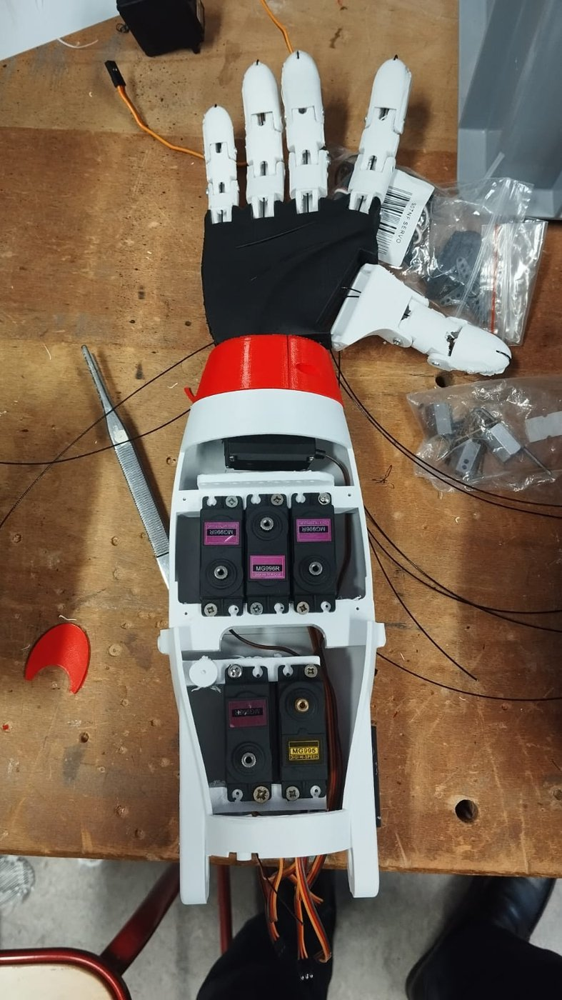 | 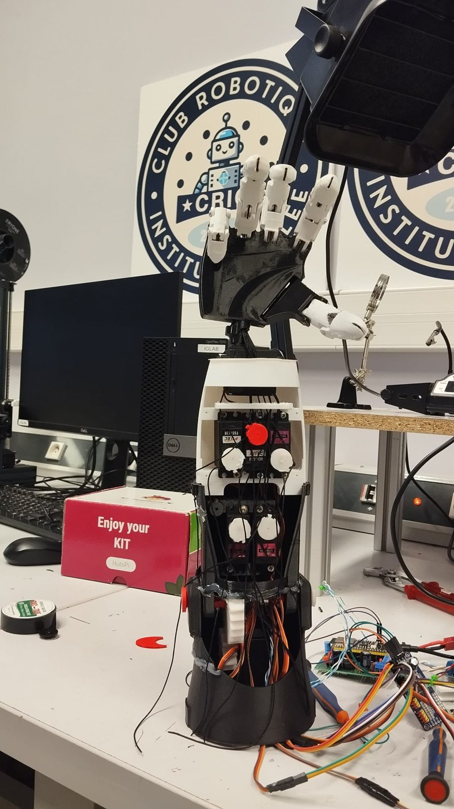 | 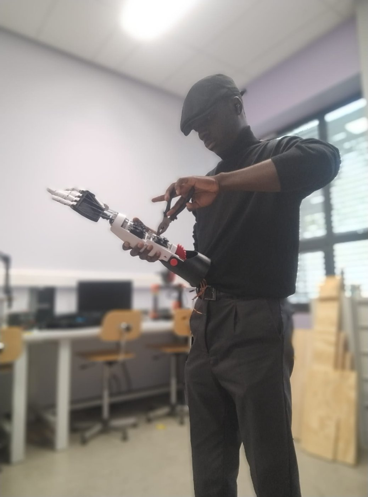 |

## The question

> **How do you turn biological muscle activity into controlled mechanical motion?**

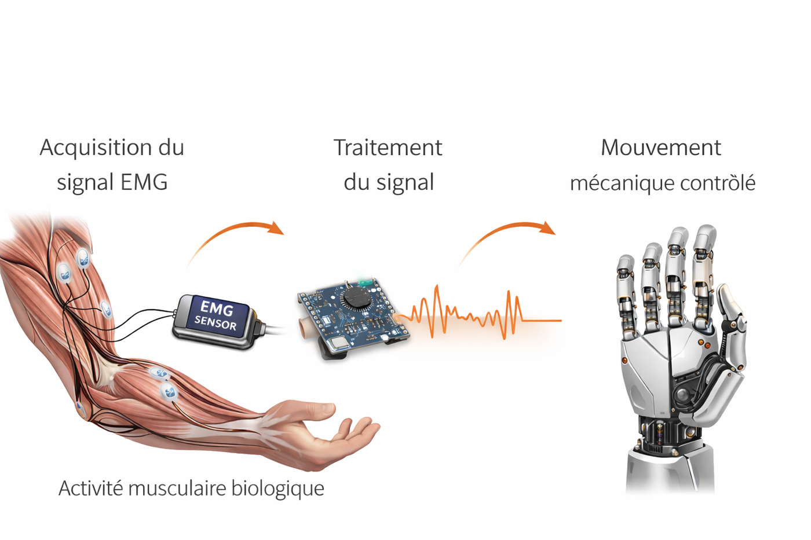

Myoelectric prostheses use the electrical activity of residual muscles to drive actuators. This project builds a complete, working chain around that idea:

- reliable **EMG acquisition** from the forearm,
- signal conditioning and **decision logic** on an embedded MCU,
- control of a **multi-finger 3D-printed hand**,
- **sensory feedback** to the user (vibration, light, sound),
- a **physical prototype** fabricated and tested.

| Parameter | Value |
|---|---|
| EMG sensor | MyoWare module (differential amplifier + analog filtering) |
| Main controller | ESP32-S3 |
| Actuator driver | PCA9685, 16-channel PWM over I2C |
| Actuators | Servomotors with nylon-tendon transmission |
| Auxiliary sensors | FSR RP-S40-ST (pressure), BMP280 (environment), potentiometer |
| Feedback | Vibration motor, passive buzzer, WS2812B LED strip |
| Power | Two separate rails: ~5 V logic, ~5.5 V actuators |
| Structure | PLA + TPU 3D printing, 1 mm nylon tendons |
| Total mass | ~470 g |

## System architecture

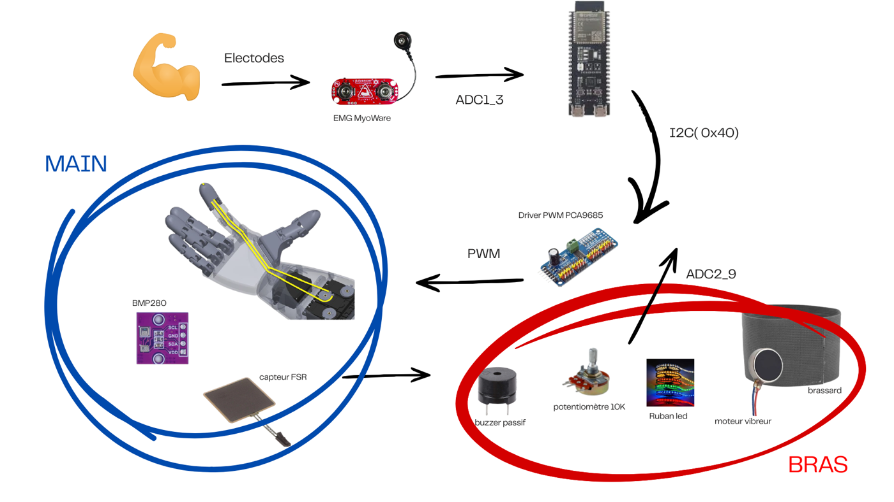

```text
 Forearm muscle
      │ µV to mV
      ▼
 ┌───────────────┐  analog   ┌──────────────────────┐   I2C   ┌──────────┐  PWM  ┌─────────────┐
 │ MyoWare EMG   │ ────────► │      ESP32-S3        │ ──────► │ PCA9685  │ ────► │ Finger      │
 │ amp + filter  │   ADC     │ acquisition, logic,  │         │ 16-ch PWM│       │ servos      │
 └───────────────┘           │ feedback control     │         └──────────┘       └──────┬──────┘
                             └──────────┬───────────┘                                   │ tendons
     FSR RP-S40-ST ── ADC ─────────────►│                                               ▼
     BMP280 ────────── I2C ────────────►│                                       3D-printed hand
     Potentiometer ─── ADC ────────────►│
                                        ├──► Vibration motor (haptic)
                                        ├──► Buzzer (audio)
                                        └──► WS2812B LED strip (visual)

  Logic rail ~5 V  ║  Actuator rail ~5.5 V   (separated to keep motor noise out of the EMG chain)
```

## EMG acquisition

The EMG signal is tiny (µV to a few mV) with a useful band of roughly **20 to 450 Hz**. The MyoWare module provides differential amplification, analog filtering and an analog output read by the ESP32-S3 ADC.

A typical EMG chain:

```text
Electrodes ──► Differential amplification ──► High-pass (drift) ──► Low-pass (HF noise) ──► 50 Hz rejection ──► Envelope ──► ADC
```

Electrode placement proved to be one of the main factors of signal quality.

| Relaxed forearm | Contraction |
|---|---|
| 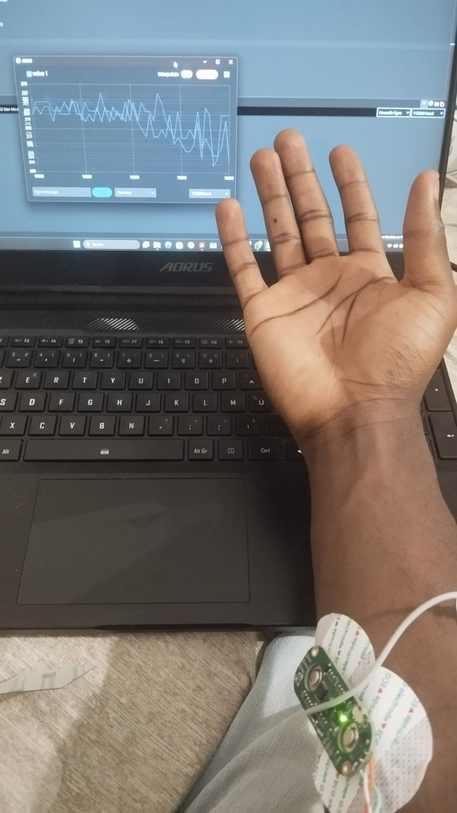 | 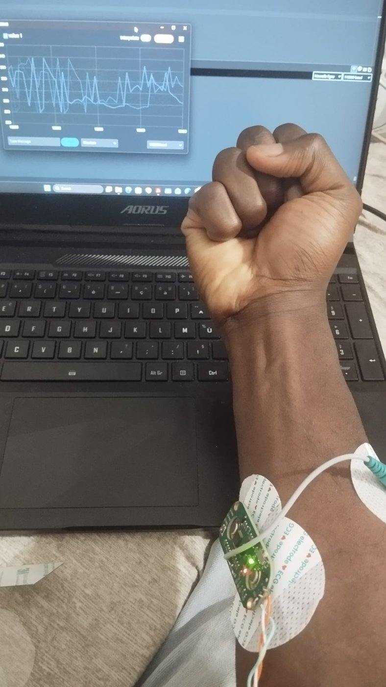 |

<details>
<summary><b>Electrode placement and FSR serial readings</b></summary>

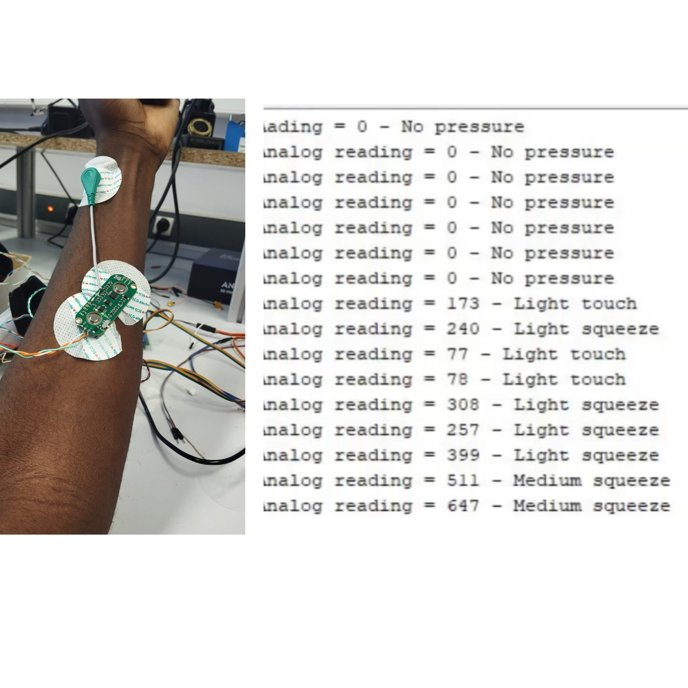

</details>

## Electronics

| Prototype board | Integration in the forearm | Power rail check |
|---|---|---|
| 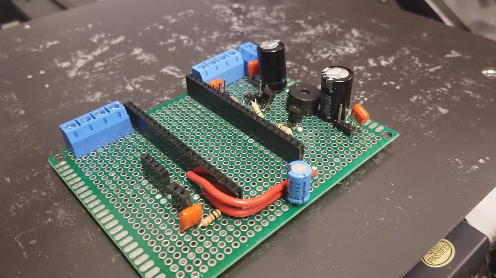 | 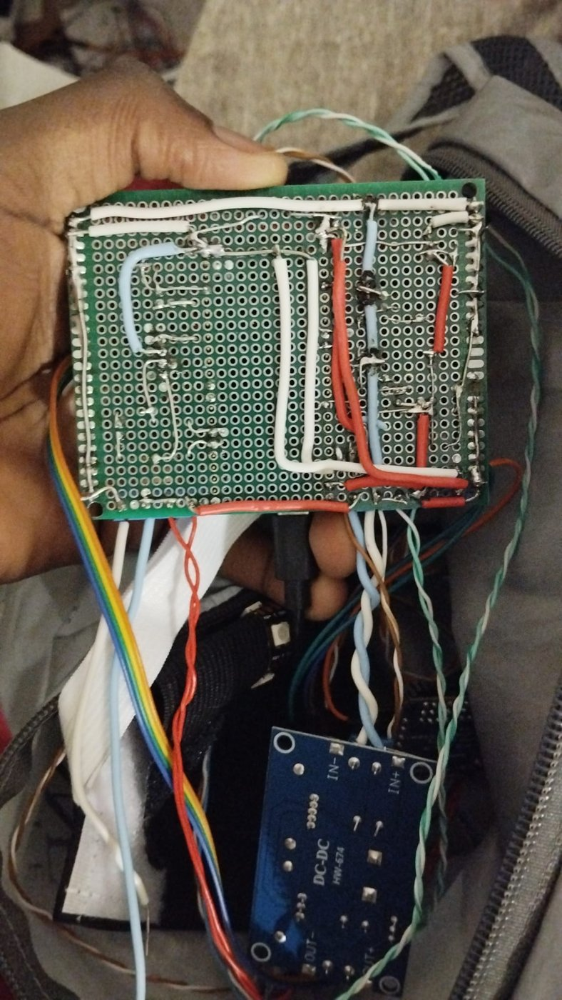 | 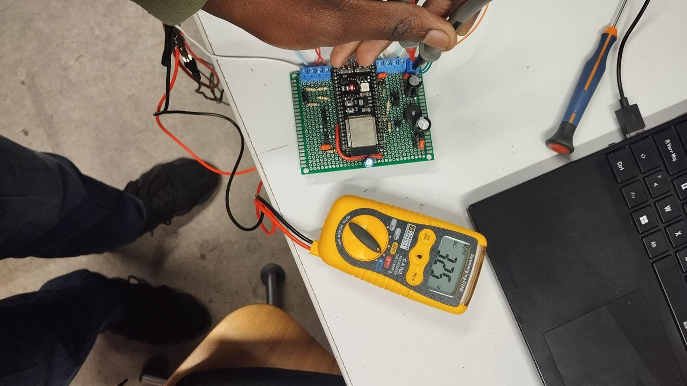 |

### Actuation

The ESP32-S3 drives the servos through a **PCA9685** over I2C: 16 independent, stable PWM channels, simultaneous multi-finger control and less load on the MCU.

### Pressure sensing

The **RP-S40-ST** FSR (40 x 40 mm, 36 x 36 mm active area, ~0.45 mm thick, ~20 g to 10 kg range, response under 10 ms according to its datasheet) is read through a voltage divider. Its resistance drops as force increases. It is used to detect contact, estimate grip qualitatively and trigger feedback above a threshold. It is a relative pressure sensor, not a precision load cell: non-linear response and hysteresis.

### Power

Two separate rails prevent servo current peaks from injecting noise into the EMG acquisition: about **5 V for logic** and about **5.5 V for actuators**.

<p align="center">
  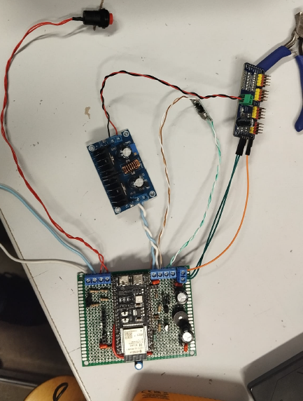
</p>
<p align="center"><i>Power distribution wiring: DC/DC converter, main control board and actuator rail.</i></p>

## Mechanical design

| Hand CAD | Forearm integration CAD |
|---|---|
| 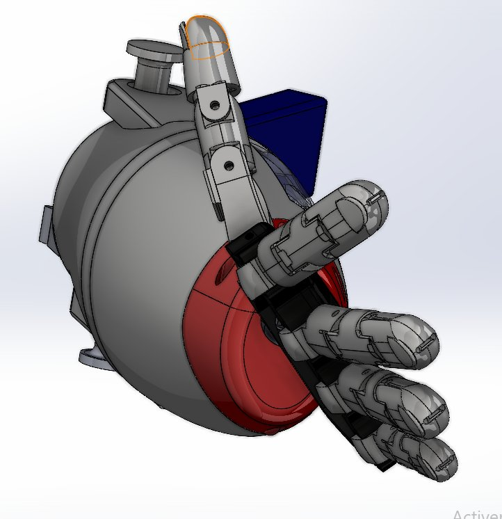 | 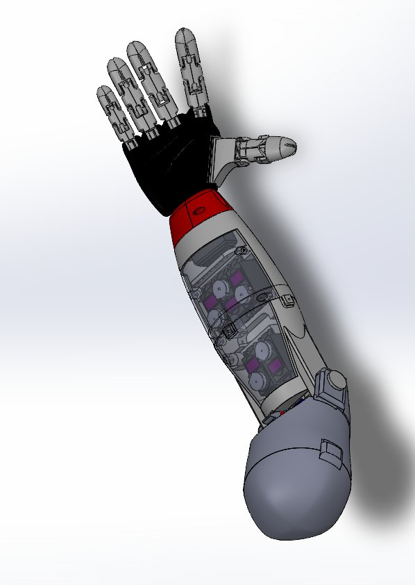 |

The CAD defines the overall geometry, the space for boards, sensors and servos, and the routing of the tendon transmissions.

> **Credit.** The mechanical design is partially based on an existing model that was acquired and then modified for this project. Electronics integration, firmware, experiments and documentation are my own work.

## Fabrication

| 3D printing | Mechanical assembly |
|---|---|
| 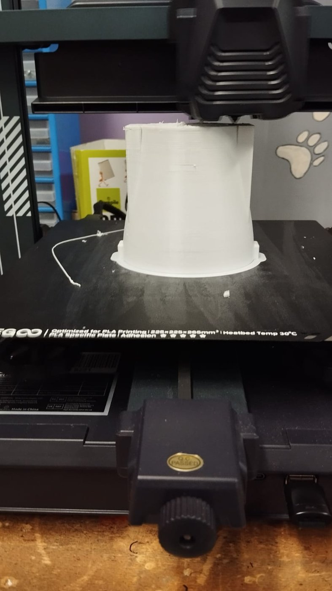 | 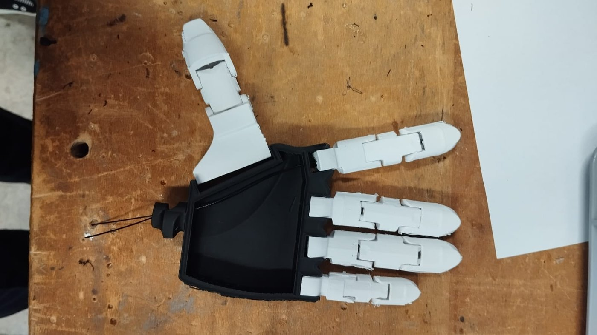 |

- PLA 1.75 mm for the rigid structure
- TPU 1.75 mm for flexible parts
- 1 mm nylon line for tendon transmissions

## Sensory feedback

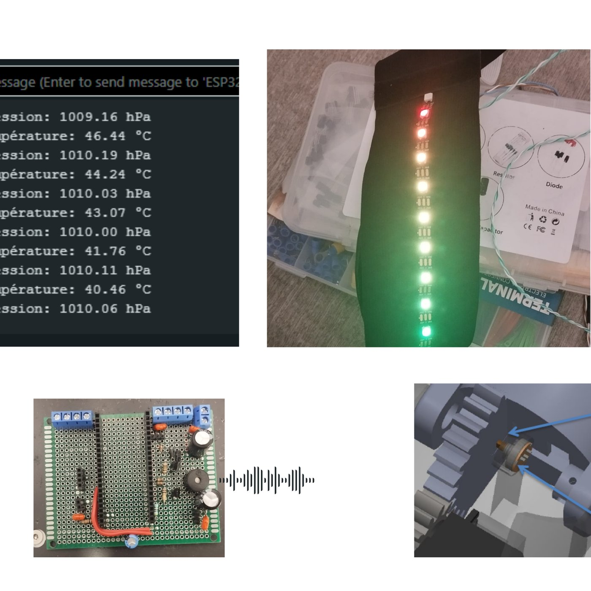

| Modality | Device | Use |
|---|---|---|
| Haptic | Vibration motor | Signals contact or grip events to the user |
| Visual | WS2812B LED strip | System state and intensity |
| Audio | Passive buzzer | Alerts and confirmations |

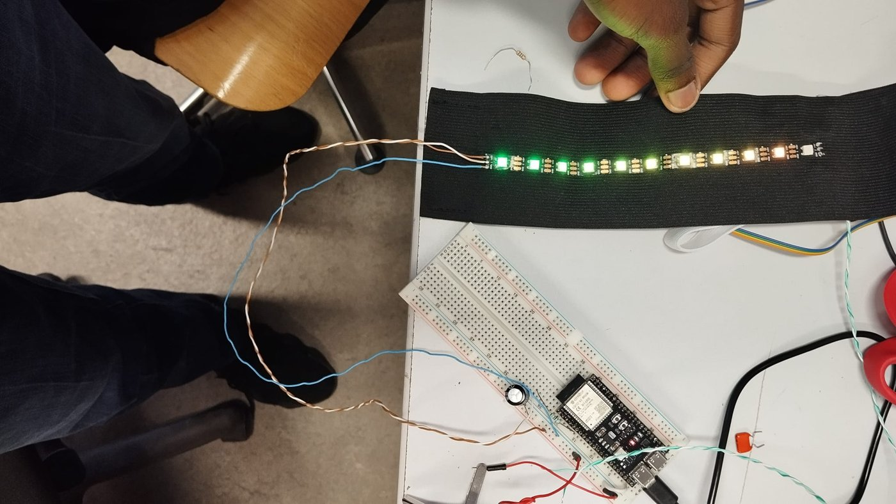

## Firmware

Each subsystem was developed and validated in its own Arduino sketch before integration:

| Sketch | Purpose |
|---|---|
| [`firmware/`](firmware/firmware.ino) | Integrated firmware: EMG acquisition, decision logic, actuator and feedback control |
| [`test_emg/`](test_emg/test_emg.ino) | EMG signal acquisition test |
| [`test_servo/`](test_servo/test_servo.ino) | Servo motion test |
| [`test_servo_continus/`](test_servo_continus/test_servo_continus.ino) | Continuous-rotation servo test |
| [`pos_zero/`](pos_zero/pos_zero.ino) | Servo zero-position calibration |
| [`pos_standard/`](pos_standard/pos_standard.ino) | Standard hand position |
| [`FSR/`](FSR/FSR.ino) | FSR pressure sensor reading |
| [`test_bmp280/`](test_bmp280/test_bmp280.ino) | BMP280 sensor test |
| [`moteur_vibreur/`](moteur_vibreur/moteur_vibreur.ino) | Vibration motor (haptic feedback) |
| [`buzzer/`](buzzer/buzzer.ino) | Buzzer test |
| [`volume_buzzer/`](volume_buzzer/volume_buzzer.ino) | Buzzer volume control |
| [`ruban_led/`](ruban_led/ruban_led.ino) | WS2812B LED strip test |
| [`gradient_rgb/`](gradient_rgb/gradient_rgb.ino) | RGB gradient effect for visual feedback |

Control principle: the EMG level is sampled by the ADC, compared against thresholds or states, then translated into servo commands through the PCA9685 while the other outputs drive the feedback devices.

## Results

Validated on the physical prototype:

- [x] EMG acquisition on a real forearm, with clear difference between rest and contraction
- [x] Command chain from EMG to servo motion
- [x] Mechanical integration of electronics in the forearm
- [x] Haptic, visual and audio feedback modules working

Measured performance (latency, grip force, repeatability over cycles) is still to be characterised.

## Limitations

- EMG remains sensitive to noise and to **electrode placement**.
- Single-channel, threshold-based control: no proportional or multi-gesture control yet.
- Electronics still on a **prototyping board**, bulky.
- Bench prototype only, not a medical device. During tests, mains-powered equipment connected to a person requires isolation per **IEC 60601-1**, which constrained the test setup.

## Future work

- [ ] Multi-channel EMG and **AI-based gesture classification** on the ESP32-S3
- [ ] Dedicated **PCB** to replace the protoboard
- [ ] Miniaturisation and battery power for full portability
- [ ] Stronger mechanics and proportional grip control using the FSR
- [ ] Long term: biomedical certification path and CE marking

## Repository structure

```text
.
├── asset/images/          # README visuals
├── firmware/              # Integrated firmware
├── test_emg/  test_servo/  test_servo_continus/
├── pos_zero/  pos_standard/
├── FSR/  test_bmp280/
├── moteur_vibreur/  buzzer/  volume_buzzer/
├── ruban_led/  gradient_rgb/
├── .gitignore
└── README.md
```

## Acknowledgements

Supervisors Nadia Djaker and Jean-Marie Feybesse, Violeta Rodriguez for biology and anatomy guidance, Maxime Divet (REEV CARE) for technical exchanges, and the CRIG robotics club for daily support.

## Skills

Biomedical instrumentation · EMG signal acquisition · Embedded systems (ESP32-S3) · I2C / PWM actuation · Sensor integration · Haptic feedback · 3D CAD and additive manufacturing · Prototyping and testing

## Author

**Joseph Mbode**

Embedded systems and biomedical engineering, Sup Galilée, Sorbonne Paris Nord.

- LinkedIn: [Joseph Mbode](https://www.linkedin.com/in/joseph-mbode)
- GitHub: [@Josephulrich](https://github.com/Josephulrich)
